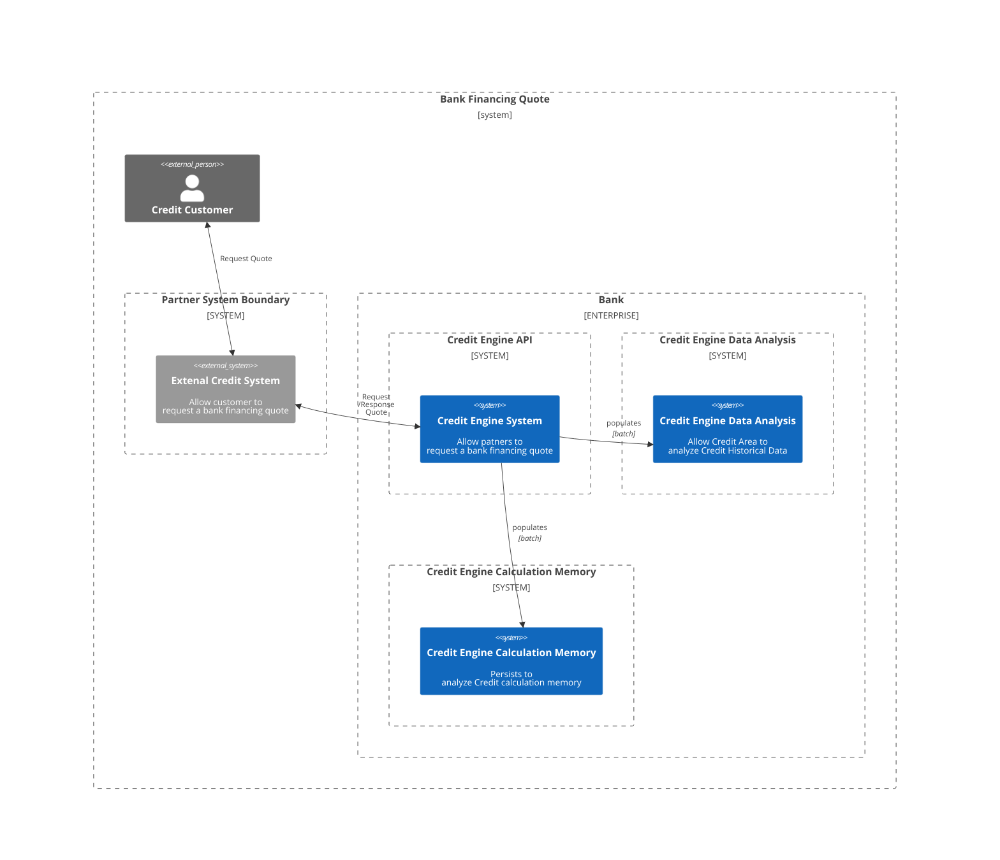
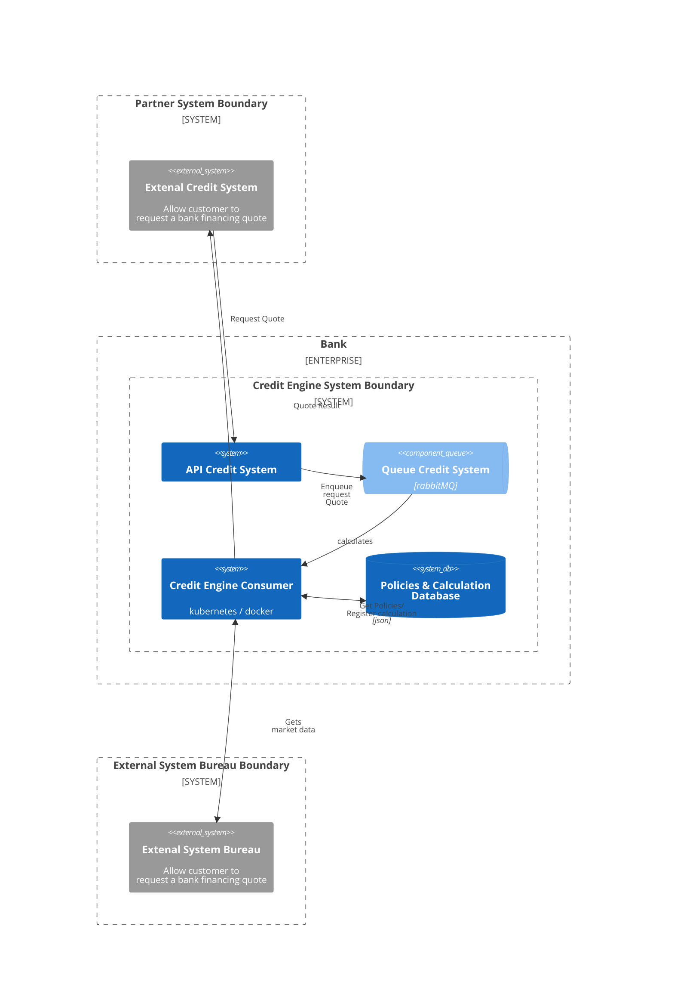
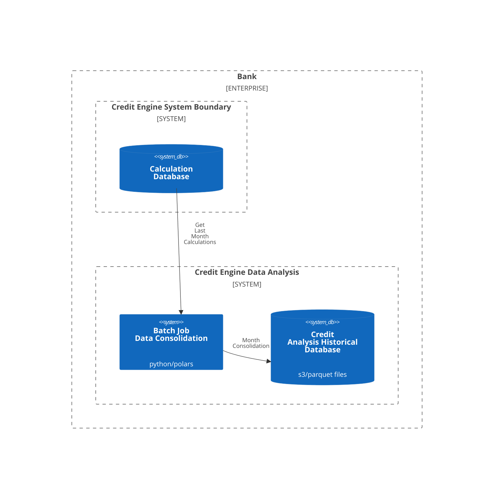

# Scalable Solution Architecture

## Context

```mermaid
C4Context

    Boundary(b0, "Bank Financing Quote"){
        Person_Ext(customer, "Credit Customer")

        System_Boundary(externalSystemBoundary, "Partner System Boundary"){
            System_Ext(externalCreditSystem, "Extenal Credit System", "Allow customer to<br /> request a bank financing quote")
        }

        Enterprise_Boundary(b1, "Bank"){
            System_Boundary(systemCreditEngineBoundary, "Credit Engine API"){
                System(systemCreditEngine, "Credit Engine System", "Allow patners to<br /> request a bank financing quote")
            }

            System_Boundary(systemCreditEngineDataAnalysisBoundary, "Credit Engine Data Analysis"){
                System(systemCreditEngineDataAnalysis, "Credit Engine Data Analysis", "Allow Credit Area to<br /> analyze Credit Historical Data")
            }

            System_Boundary(systemCreditEngineCalculationMemoryBoundary, "Credit Engine Calculation Memory"){
                System(systemCreditEngineCalculationMemory, "Credit Engine Calculation Memory", "Persists to<br /> analyze Credit calculation memory")
            }
        }
    }

    BiRel(customer, externalCreditSystem, "Request Quote")
    BiRel(externalCreditSystem, systemCreditEngine, "Request<br />/Response<br /> Quote")
    Rel(systemCreditEngine, systemCreditEngineDataAnalysis, "populates", "batch")
    Rel(systemCreditEngine, systemCreditEngineCalculationMemory, "populates", "batch")

    UpdateRelStyle(customer, externalCreditSystem, $offsetY="-50")
    UpdateRelStyle(externalCreditSystem, systemCreditEngine, $offsetY="-20")
    UpdateRelStyle(systemCreditEngine, systemCreditEngineDataAnalysis, $offsetY="-30")
    UpdateRelStyle(systemCreditEngine, systemCreditEngineCalculationMemory, $offsetY="-30")
```

## Container

### Credit Engine System

```mermaid
C4Container

    System_Boundary(externalSystemBoundary, "Partner System Boundary"){
        System_Ext(externalCreditSystem, "Extenal Credit System", "Allow customer to<br /> request a bank financing quote")
    }

    Enterprise_Boundary(b1, "Bank"){
        System_Boundary(creditEngineSystemBoundary, "Credit Engine System Boundary"){
            System(apiCreditSystem, "API Credit System")
            ComponentQueue(queueCreditSystem, "Queue Credit System", "rabbitMQ")
            System(creditSystemConsumer, "Credit Engine Consumer", "kubernetes / docker")
            SystemDb(database, "<br />Policies & Calculation<br /> Database")
        }
    }

    System_Boundary(externalSystemBureauBoundary, "External System Bureau Boundary"){
        System_Ext(externalSystemBureau, "Extenal System Bureau", "Allow customer to<br /> request a bank financing quote")
    }

    Rel(externalCreditSystem, apiCreditSystem, "Request Quote")
    Rel(apiCreditSystem, queueCreditSystem, "Enqueue<br />request<br />Quote")
    Rel(queueCreditSystem, "creditSystemConsumer", "calculates")
    BiRel(creditSystemConsumer, database, "Get Policies/<br />Register calculation", "json")
    BiRel(creditSystemConsumer, externalSystemBureau, "Gets<br />market data")
    Rel(creditSystemConsumer, externalCreditSystem, "Quote Result")

    UpdateLayoutConfig($c4ShapeInRow="3", $c4BoundaryInRow="1")
    UpdateRelStyle(externalCreditSystem, apiCreditSystem, $offsetX="10", $offsetY="-30")
    UpdateRelStyle(apiCreditSystem, queueCreditSystem, $offsetX="-20", $offsetY="30")
    UpdateRelStyle(queueCreditSystem, creditSystemConsumer, $offsetX="-30", $offsetY="15")
    UpdateRelStyle(creditSystemConsumer, creditSystemConsumer, $offsetX="-30", $offsetY="15")
    UpdateRelStyle(creditSystemConsumer, externalCreditSystem, $offsetX="110", $offsetY="15")
    UpdateRelStyle(creditSystemConsumer, database, $offsetX="20", $offsetY="15")
    UpdateRelStyle(creditSystemConsumer, externalSystemBureau, $offsetX="70", $offsetY="5")


```

### Credit Engine Data Analysis

```mermaid
C4Container

    Enterprise_Boundary(b1, "Bank"){
        System_Boundary(creditEngineSystemBoundary, "Credit Engine System Boundary"){
            SystemDb(database, "<br />Calculation<br /> Database")
        }

        System_Boundary(systemCreditEngineDataAnalysisBoundary, "Credit Engine Data Analysis"){
            System(batchJob, "Batch Job<br /> Data Consolidation", "python/polars")
            SystemDb(dw, "<br /><br />Credit<br /> Analysis Historical<br /> Database", "s3/parquet files")
        }
    }

    Rel(database, batchJob, "Get<br /> Last<br /> Month<br /> Calculations")
    Rel(batchJob, dw, "Month<br /> Consolidation")

    UpdateRelStyle(database, batchJob, $offsetX="10", $offsetY="-40")
    UpdateRelStyle(batchJob, dw, $offsetX="-30", $offsetY="-30")

    UpdateLayoutConfig($c4ShapeInRow="3", $c4BoundaryInRow="1")

```

### Credit Engine Calculation Memory

```mermaid
C4Container

    Enterprise_Boundary(b1, "Bank"){
        System_Boundary(creditEngineSystemBoundary, "Credit Engine System Boundary"){
            SystemDb(database, "<br />Calculation<br /> Database")
        }

        System_Boundary(systemCreditEngineDataAnalysisBoundary, "Credit Engine Data Analysis"){
            System(batchJob, "<br /><br />Batch Job<br /> Calculation Memory<br />  Persistence", "python/polars")
            SystemDb(s3, "<br /><br />Credit<br /> Calculation Memory<br /> Database", "s3/parquet files")
        }
    }

    Rel(database, batchJob, "Get<br /> Last<br /> Month<br /> Calculations")
    Rel(batchJob, s3, "Monthly<br /> Consolidation")

    UpdateRelStyle(database, batchJob, $offsetX="10", $offsetY="-40")
    UpdateRelStyle(batchJob, s3, $offsetX="-30", $offsetY="-30")

    UpdateLayoutConfig($c4ShapeInRow="3", $c4BoundaryInRow="1")

```